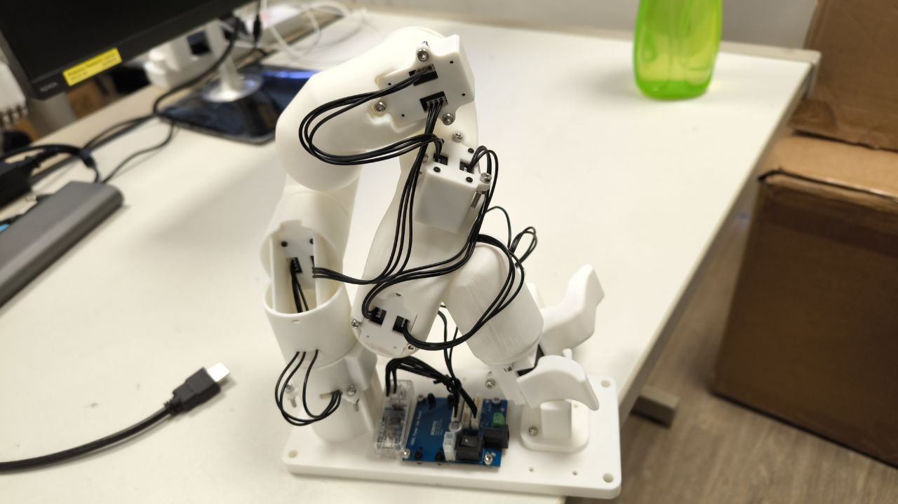

# CAD_Portfolio
This repository serves as a catalog of my mechanical design CAD projects, featuring work in **SolidWorks** and **Autodesk Fusion**.
All the CAD is done independently unless otherwise stated.

---

## Technical Stack & Tools

| Category | Tools |
| :--- | :--- |
| **CAD** | SolidWorks, Autodesk Fusion |
| **Simulation** | MuJoCo, Ansys |
| **Slicing** | Bamboo Studio, Prusa Slicer, Ultimaker Cura  |
| **Relevant Module** | Engineering Graphics, Machine Element Design, Theory of Mechanism, Dynamics |

---

## Certifications
* **Certified SOLIDWORKS Professional (CSWP)**

---

## Featured Projects

### 1. 6-DoF Teleoperation Robotic Arm for UFactory xArm6
**Software:** Autodesk Fusion, Bamboo Studio
**Date:** Jul 2025

Designed a low-cost, tailored teleoperation arm to capture human-guided manipulation data for training Vision-Language-Action (VLA) models.
* **Design:** Created a custom 6-Degree-of-Freedom arm structure optimized for ergonomic teleoperation.
* **Integration:** Restructured URDF files to achieve precise Sim-to-Real control with MuJoCo.
* **Outcome:** Successfully used for collecting synchronized vision and action data.

(CAD_Picture/xarm/xarm_2.jpg)(CAD_Picture/xarm/xarm_3.jpg)

### 2. "More-Tea" Autonomous Pet Robot
**Software:** Autodesk Fusion, Ultimaker Cura, Bamboo Studio
**Date:** May 2025

Innovated a pet robot capable of interaction via gesture and speech.
* **Chassis Design:** Designed the complete external appearance and internal component mounts.
* **Electronics Integration:** Engineered precise mounting points for servo motors, OLED displays, and other components.
* **Manufacturing:** Optimized parts for printing on Bamboo Lab and Prusa printers.

### 3. "Green it!" Hydroponics Control System
**Software:** Autodesk Fusion, Ultimaker Cura
**Date:** Dec 2024

* **Enclosure Design:** Constructed a waterproof enclosure to secure electric components and microcontrollers.
* **Fluid Systems:** Designed mounts for piping and raw sensors.

### 4. Micromouse Robotics Competition
**Software:** SolidWorks
**Date:** Jan 2025

Designed the mechanical structure for a high-speed autonomous maze-solving robot.
* **Optimization:** Focused on weight reduction and center-of-gravity optimization for high-speed turns.
* **Components:** Designed chassis, motor mounts, and sensor brackets.

### 5. Other Project
**Software:** Autodesk Fusion, SolidWorks, Bamboo Studio, Prusa Slicer, Ultimaker Cura
Credit to Aqid for the Ball Launcher Bot's launcher design

---

## 📬 Contact
If you'd like to discuss my designs or collaborate on a project, feel free to reach out!
* [LinkedIn](https://www.linkedin.com/in/humingjie)
* [Email](mingjiehu5@gmail.com)
